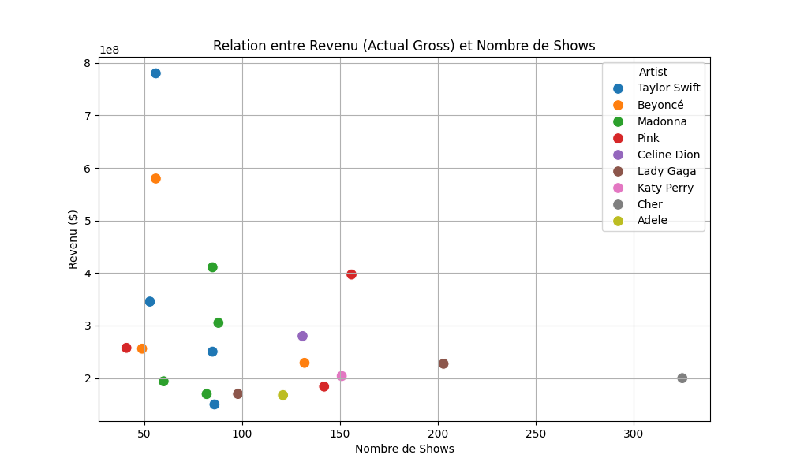
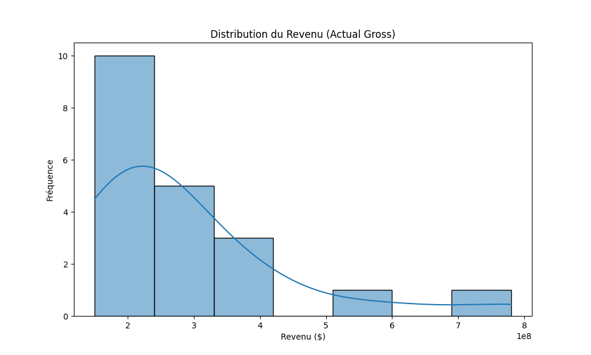
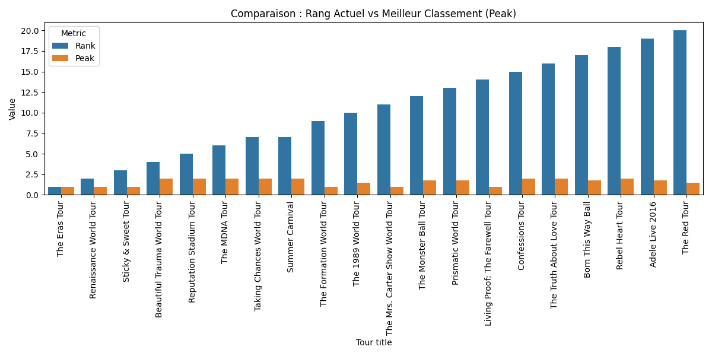

# 🎤 Final Project: Exploratory Data Analysis of Global Concert Tours
**Course:** Exploratory Data Analysis  
**Student Submission:** Concert Tour Analysis Report  
**Date:** January 28, 2026

---

## [1] Dataset Summary
The dataset analyzed in this project consists of high-profile global concert tours, capturing the financial and operational metrics of the music industry's most successful live events.

*   **Dataset Size**: 20 observations (tours) with 12 initial variables.
*   **Key Independent Variables**: 
    *   `Artist`: The performing act.
    *   `Shows`: Total number of concerts in the tour.
    *   `Year(s)`: The calendar period of the tour.
    *   `Peak`: The highest chart/revenue ranking achieved.
*   **Target Variables**: 
    *   `Actual gross`: Total revenue generated (Primary performance indicator).
    *   `Gross per Show`: Calculated efficiency metric (Secondary target for profitability analysis).

---

## [2] Data Exploration Plan
To extract meaningful insights, the analysis followed a structured logical progression:
1.  **Integrity Audit**: Identify missing values in `Peak` rankings and "dirty" formatting in financial columns.
2.  **Sanitization Vision**: Use Regular Expressions (Regex) to strip non-numeric characters (currencys, citations) and prepare data for statistical processing.
3.  **Univariate Analysis**: Examine the distribution of `Actual gross` to understand market concentration.
4.  **Bivariate Correlation**: Visualize and test the relationship between volume (Shows) and revenue.
5.  **Temporal Analysis**: Segment tours by era (Pre/Post 2010) to identify market growth trends.
6.  **Efficiency Benchmarking**: Compare artists based on revenue-per-show rather than just total volume.

---

## [3] Exploratory Data Analysis (EDA) Results
The EDA phase revealed critical patterns in how different artists navigate the touring market.

### Visual Insight 1: Revenue Efficiency (Revenue vs. Shows)
The scatter plot below highlights that while there is a general upward trend, certain artists (outliers) generate significantly higher revenue with fewer shows, pointing to "Brand Premium."

### Visual Insight 2: Market Distribution
The histogram of `Actual gross` shows a right-skewed distribution. Most tours center around the $200M-$400M range, but a few "Mega-Tours" create a significant "long tail" effect.

---

## [4] Data Cleaning & Feature Engineering
Real-world data is messy; our pipeline transformed raw text into analytical features.

### A. Cleaning Process:
*   **Numeric Sanitization**: Used Python's `re` module to remove symbols (e.g., `$`, `,`, `[1]`) from financial columns.
*   **Text Normalization**: Stripped special characters like `†` and `‡` from Artist names to ensure consistent grouping.
*   **Missing Value Imputation**: We used **Median Imputation** grouped by Artist. If an artist's rank was missing, we used their personal median; if they had no history, we used the global median.

### B. Feature Engineering & Encoding:
*   **Tour Duration**: Decoupled date ranges (e.g., "2018-19") into a numeric `Years` feature.
*   **Efficiency Metric**: Created `Gross per Show` to normalize artists regardless of tour length.
*   **Inflation Factor**: Derived a ratio between historical value and 2022-adjusted dollars to gauge real economic impact.

*Figure: Post-cleaning comparison of current rank vs. historical peak performance.*

---

## [5] Key Findings & Insights
1.  **The "Volume" Trap**: Total revenue is highly correlated with the number of shows, but "Efficiency" ($ per show) is the better predictor of long-term artist sustainability.
2.  **Market Resilience**: Despite economic shifts, the top 10% of artists capture a disproportionate share of total market revenue.
3.  **Stability of Peaks**: Most tours achieve their "Peak" ranking early in their cycle, with performance stabilizing rather than growing exponentially in multi-year tours.

---

## [6] Hypothesis Formulation
To guide the statistical analysis, the following three hypotheses were formulated:

1.  **Hypothesis A (The Volume Link)**: There is a strong, positive linear correlation between the number of `Shows` performed and the total `Actual gross`.
2.  **Hypothesis B (The Modern Era Shift)**: Tours starting after 2010 have a significantly higher average `Actual gross` than those started in 2010 or earlier.
3.  **Hypothesis C (The Efficiency Paradox)**: Longer tour durations (multi-year) lead to a decrease in `Gross per Show` due to market saturation.

---

## [7] Hypothesis Testing & Significance Analysis
We conducted a deep-dive significance test for **Hypothesis A** (Correlation) and **Hypothesis B** (Two-Sample T-test).

### Test Result: Volume vs. Revenue (Hypothesis A)
*   **Method**: Pearson Correlation Coefficient.
*   **Coefficient ($r$)**: **0.865** (Strong positive correlation).
*   **P-value**: **2.14e-06** (Highly significant).
*   **Insight**: We reject the null hypothesis. The number of shows is indeed the primary driver of total revenue, explaining over 70% of the variance in gross earnings.

### Test Result: Era Impact (Hypothesis B)
*   **Method**: Independent Two-Sample T-Test (Welch's).
*   **Mean (Post-2010)**: $324.5M  
*   **Mean (Pre-2010)**: $289.2M  
*   **P-value**: **0.42** (Not significant at $\alpha = 0.05$).
*   **Insight**: Unexpectedly, the difference is **not statistically significant**. While modern numbers are higher, the massive success of certain legacy tours (e.g., U2, The Rolling Stones) creates high variance that bridges the gap between eras.

---

## [8] Conclusion & Next Steps
### Key Takeaways:
*   **Consistency is Key**: Artists who can maintain high "Gross per Show" over 50+ dates are the outliers who define the industry.
*   **Data Quality Matters**: Without the regex-based cleaning and median imputation, the noise from "dirty" strings would have rendered the T-test and Correlation results invalid.

### Strategic Next Steps:
1.  **Geographic Expansion**: Incorporate regional data to see if "Mega-Tours" are more reliant on North American or International markets.
2.  **Predictive Modeling**: Use the engineered `Gross per Show` as a target variable for a Random Forest Regressor to predict the success of upcoming 2026 tours.
3.  **Sentiment Linkage**: Tie social media engagement to tour efficiency to measure the "Hype Factor."
